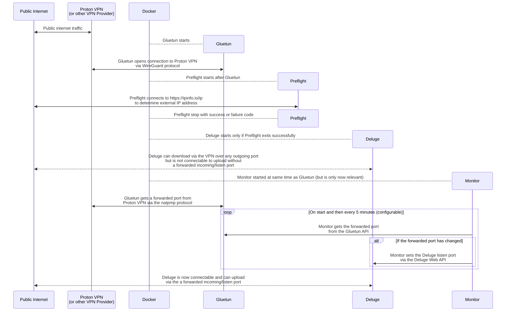

# Deluge via Proton VPN with port forwarding

This is part 1 of the series: [Deluge via Proton VPN with port forwarding](https://github.com/RogueOneEcho/how-to-setup-deluge-with-protonvpn-portforward).

This part shows how to make Deluge connectable via Proton VPN with port forwarding.

All services are run in Docker containers and managed with Docker Compose.

> [!TIP]
> Due to the flexibility of [Gluetun](https://github.com/qdm12/gluetun) the guide can be easily adapted to work with any wireguard or OpenVPN based VPN provider by referring to the [Gluetun wiki documentation](https://github.com/qdm12/gluetun-wiki).

> [!IMPORTANT]
> Prior knowledge of Docker, Deluge and linuxserver.io containers are assumed.

## Technologies
- [Docker Compose](https://docs.docker.com/compose/install/)
- [Deluge - linuxserver.io container](https://fleet.linuxserver.io/image?name=linuxserver/deluge)
- [Gluetun](https://github.com/qdm12/gluetun)
- [Proton VPN](https://protonvpn.com/)
- [WireGuard](https://www.wireguard.com/)

## How it works



### Gluetun

The `tunnel` service runs [Gluetun](https://github.com/qdm12/gluetun) which:
- tunnels network traffic via the VPN
- obtains a forwarded port from the VPN provider via the natpmp protocol

The other services use `tunnel` as their network due to `network_mode: "service:tunnel"`.

### Preflight

The `preflight` service runs a [bash script](preflight/preflight) to check:
- the `/srv/shared` is mounted. It does so by checking it contains at least one file
- the external ip https://ipinfo.io/ip is reported as the VPN.

Only after `preflight` exits successfully do the `deluge` and `prowlarr` services start due to:

```yaml
depends_on:
  preflight:
    condition: service_completed_successfully
```

### Monitor

The `monitor` service runs a [bash script](monitor/monitor) that obtains the forwarded port from the Gluetun API and sets the incoming listening port of `deluge`.

If the monitor script fails it waits for a duration defined as `RETRY` then retries. Once it's successful it waits a duration defined by `INTERVAL` before running again, therefore if the forwarded port happens to change it will be updated in `deluge`.

### Deluge

The `deluge` service runs the [Deluge](https://deluge-torrent.org/) web client and daemon as a [linux-server.io container](https://fleet.linuxserver.io/image?name=linuxserver/deluge).

The Deluge web client is available at http://localhost:8112.

## Getting started

### 1. Create a WireGuard configuration

From the ProtonVPN website, [create a WireGuard configuration](
https://account.proton.me/u/3/vpn/WireGuard).

Use a memorable `device/certificate name` so you can easily revoke or extend it later.

Set the platform to `GNU/Linux`.

Set `Level for NetShield blocker filtering` to `No filter` - probably not required.

Set `Moderate NAT` to `Yes` - probably not required.

Set `NAT-PMP (Port Forwarding)` to `Yes` - **important**.

Set `VPN Accelerator` to `Yes` - probably not required.

Select a server location from `Standard server configs` that has the `⇆` icon for `P2P`. Avoid any TOR servers.

Save the file as you won't be able to read the private key again.

The file should look something like this:

```ini
[Interface]
# Key for deluge
# Bouncing = 14
# NetShield = 0
# Moderate NAT = on
# NAT-PMP (Port Forwarding) = on
# VPN Accelerator = on
PrivateKey = CIGiABCDEFGkNDgXCiyidFc61ybHJ1S5ufvUd2NNG3k=
Address = 10.2.0.2/32
DNS = 10.2.0.1

[Peer]
# CH#999
PublicKey = n+45suABCDEFGuZWtCnzGkXNBCgJB3wFZYIlBltpORM=
AllowedIPs = 0.0.0.0/0
Endpoint = 203.0.113.1:51820
```

### 2. Update the `tunnel` environment variables

> [!NOTE]
> Docker has a few ways to pass environment variables to containers, in this guide we're using `.env` files [learn more about them here](https://docs.docker.com/compose/how-tos/environment-variables/variable-interpolation/#env-file-syntax).

Copy `tunnel/.env.example` to `tunnel/.env`:

```bash
cp tunnel/.env.example tunnel/.env
```

Set the environment variables by copying the values from the WireGuard configuration file:

- `PrivateKey` to `WIREGUARD_PRIVATE_KEY`
- `Address` to `WIREGUARD_ADDRESSES`
- `PublicKey` to `WIREGUARD_PUBLIC_KEY`
- The IP address from `Endpoint` to `WIREGUARD_ENDPOINT` - `203.0.113.1` in this example.
- The port from `Endpoint` to `WIREGUARD_PORT` - `51820` in this example.

> [!TIP]
> The `WIREGUARD_PRIVATE_KEY` works for any Proton VPN server, so Gluetun can automatically pick a server for you if you prefer. Just copy the `dynamic.env` file instead.

> [!TIP]
> For other VPN providers, you can follow their documentation to create a WireGuard configuration, or refer to the [Gluetun documentation](https://github.com/qdm12/gluetun-wiki).

If you're using a VPN provider who use pre-shared keys then also:

- `PreSharedKey` to `WIREGUARD_PRESHARED_KEY`

### 3. Update the `monitor` environment variables

Copy `monitor/.env.example` to `monitor/.env`:

```bash
cp monitor/.env.example monitor/.env
```

Set the `DELUGE_PASSWORD` variable to your desired Deluge Web Client password.

> [!TIP]
> The frequency and verbosity of the monitor script can also be adjusted.
> While setting up `LOG_LEVEL=debug` is useful but once everything is working it's best to set it to `warn` to reduce the log size.

### 4. Update the shared environment variables

Copy `.env.example` to `.env`:

```bash
cp .env.example .env
```

Run the `id` command to determine the values your user id and group id. Typically, these will both be `1000` but they can vary.

Set the `USER_ID` to the user id number return by the `id` command.

Set the `GROUP_ID` to the group id number return by the `id` command.

For example if `id` returns:

```
uid=1234(your_user) gid=5678(your_group)
```

Then use:

```ini
USER_ID=1234
GROUP_ID=5678
```

> [!TIP]
> You can set the timezone value `TZ` to your [TZ identifier](https://en.wikipedia.org/wiki/List_of_tz_database_time_zones#List), but it's best practice to stick with `UTC` for servers to reduce confusion when reading logs.

### 5. Start the tunnel service

Start up the `tunnel` service in detached mode and wait for it to report `Healthy`:

```bash
docker compose up -d --wait tunnel
```

> [!TIP]
> If `tunnel` is `Unhealthy` or fails you've probably not configured `tunnel/.env` correctly, check the logs:
> ```bash
> docker compose logs tunnel -f
> ```

### 6. Start the preflight service

Preflight is going to check the `/srv/shared` directory so make sure it contains at least one file:

```bash
touch /srv/shared/.not-empty
```

Start up the `preflight` service in attached mode

```bash
docker compose up preflight
```

At this stage the `preflight` service will fail as we haven't set the environment variables because we didn't know the external IP address of the VPN.

Copy `preflight/.env.example` to `preflight/.env`:

```bash
cp preflight/.env.example preflight/.env
```
Set `ALLOWED_IP` to the External IP seen in the `preflight` logs.

> [!TIP]
> If you're letting Gluetun pick a server for you then leave `ALLOWED_IP` blank and instead set the value of `DISALLOWED_IP` to your non-VPN external IP address to ensure it doesn't leak.

Start up the `preflight` again, this time it should exit successfully.

### 7. Start the remaining services

Start up all the services in detached mode and wait for them to report `Healthy`:

```bash
docker compose up -d --wait
```

Deluge should start and report `Healthy`, but `monitor` will be `Unhealthy` as it can't authenticate with Deluge.

### 8. Access the Deluge Web UI

Once Deluge is `Healthy` you can access the Deluge web client at http://localhost:8112.

The default password is `deluge`.

In the Deluge web client you'll want to change a few settings:
- `Preferences` -> `Downloads` set `Download to` to `/srv/shared/deluge`.
- `Preferences` -> `Network` under `Incoming Port` uncheck `Random`.
- `Preferences` -> `Interface` update the `WebUI Password` to the value you defined as `DELUGE_PASSWORD`.

If you want to use the Deluge desktop client:
- `Preferences` -> `Daemon` check `Allow Remote Connections`.

Now the Web UI password has been set the `monitor` service should be able to authenticate with Deluge.

Check the status of all services:

```bash
docker ps --format "table {{.Names}}\t{{.Image}}\t{{.Status}}"
```

Wait for monitor to report `Healthy`

> [!TIP]
> If it takes a while you can follow the monitor logs:
> ```bash
> docker logs monitor -f
> ```

Head back to the Deluge Web UI and you should see the incoming port has been set.


## Troubleshooting

1. Check the logs using:

```bash
docker compose logs [SERVICE_NAME] -f
```

The logging verbosity for `monitor` and `preflight` can be adjusted by the `LOG_LEVEL` environment variable.

- `warn` is recommended for production use, only showing warnings and errors
- `info` will give an overview of what's happening
- `debug` provides insight into each set
- `trace` is detailed logging for development purposes

2. Re-read the guide
3. [Ask for help in GitHub Discussions](https://github.com/RogueOneEcho/how-to-setup-deluge-with-protonvpn-portforward/discussions)
4. [Create an issue](https://github.com/RogueOneEcho/how-to-setup-deluge-with-protonvpn-portforward/issues)

## Acknowledgements

This guide has been written by [RogueOneEcho](https://github.com/RogueOneEcho/how-to-setup-deluge-with-protonvpn-portforward).